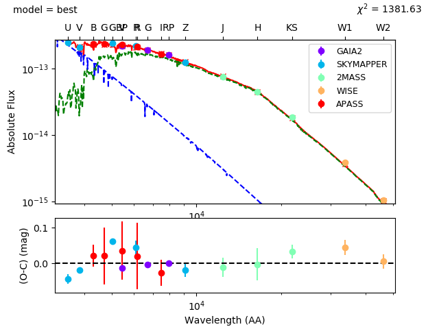
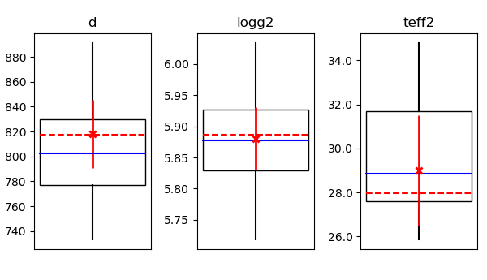
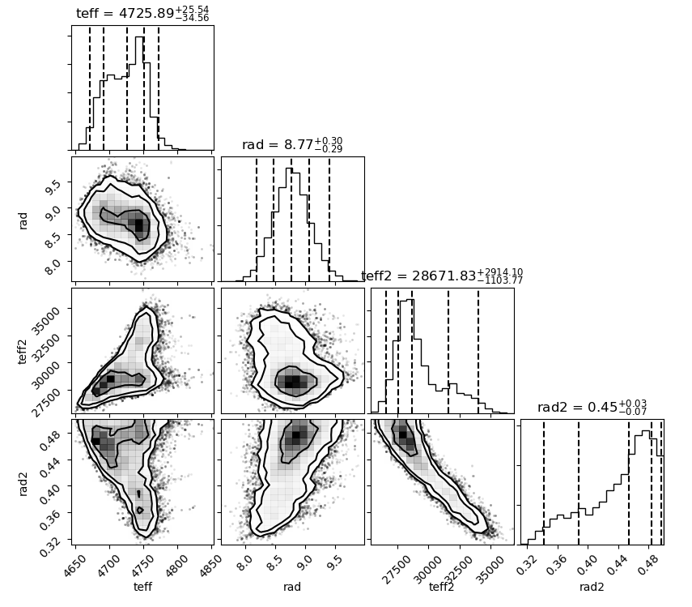

Making figures
==============

Speedyfit gives you the option to make three different kinds of plots:

- sed fit
- constraint plot
- distribution plot

You can setup all of these plots and if wanted multiple of each in the setup file for the fit. They all follow the same
basic structure, but have different option arguments:

.. code-block:: yaml

        plot1: # number of the plot, up to 10
            type: <plot type> # which type of plot you want
            path: <figurename>.png # filename in which to store the figure
            parameter: value # any other parameters to configure this plot

The different plotting types are discussed in detail below.

SED fit
-------

Type keyword: sed_fit

The SED fit, displays the used photometry, together with the integrated photometry of the best fitting model and the
full atmosphere model for the best fitting parameters. If a binary fit is performed, the full atmosphere model of both
components will be shown.

Optional arguments:

.. option:: result ('best' or 'pc')

    What model to consider the result. Pick the model with the lowest Chi2 value ('best') or the median model ('pc').

An example of this plot for the binary system BD-7 5977, an hot subdwarf binary with a sub giant companion:

Constraint plot
---------------

Type keyword: constraint

The constraint plot shows the applied constrains in red crosses with the error bars, together with the best fitting
model (lowest Chi2) in red dashed line, the median model in blue full line and the distribution of the walkers as a
wisker plot.

This plot type does not have option arguments

An example of this plot for the binary system BD-7 5977, with constraints on the distance, surface gravity and effective
temperature from spectroscopy is shown:

Distribution plot
-----------------

Type keyword: distribution

The distribution plot shows the distribution for all fitted and derived parameters. This plot type is build on top of
the `corner <https://github.com/dfm/corner.py>`_ plot
(`Daniel Foreman-Mackey 2016 <https://joss.theoj.org/papers/10.21105/joss.00024>`_).

.. option:: parameters (list)

    A list of parameters (fitted or derived) to be included in the distribution plot

.. option:: show_best (bool)

    When true, indicate in red line the parameter value with the lowest chi2 (default = False)

.. option:: quantiles (list)

    List of the quantiles to mark on the corner plot (default = [0.025, 0.16, 0.5, 0.84, 0.975], corresponding to 1 and
    2 sigma). See the `API documentation <https://corner.readthedocs.io/en/latest/api.html>`_ of corner plot for more
    details.

.. option:: levels (list)

    List of the contour levels to draw on the 2D histograms. (default = [0.393, 0.865, 0.95], the latter two
    corresponding to 1 and 2 sigma). See the `API documentation <https://corner.readthedocs.io/en/latest/api.html>`_ of
    corner plot for more details.

An example of this plot for the binary system BD-7 5977 with the distribution of the walker results for the effective
temperature and radius of both components is shown:

