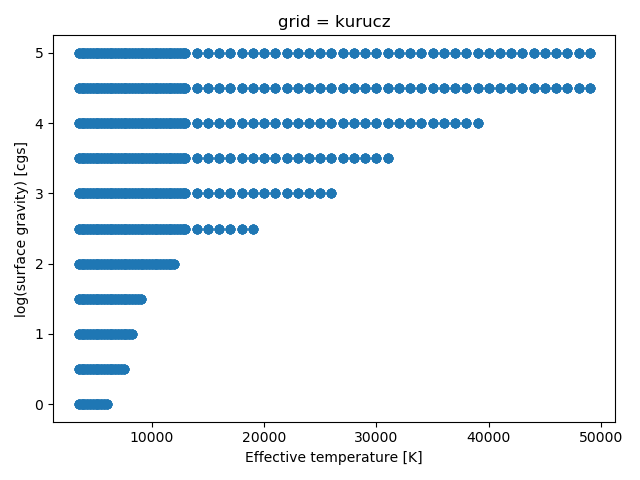
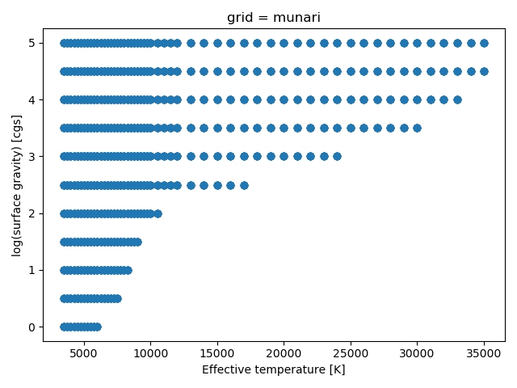
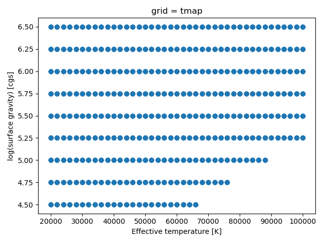
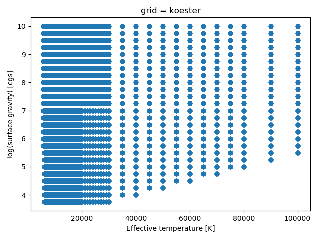
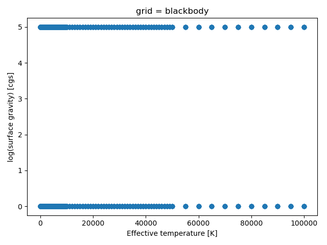
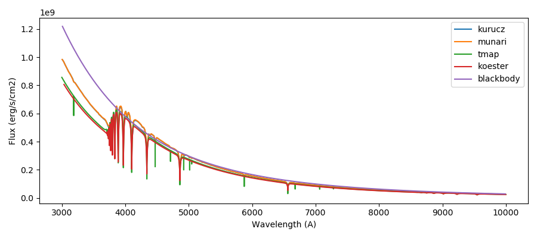

Model atmosphere grids
======================

Speedyfit is provided with 5 grids of model atmospheres. Below the range in effective temperature and surface gravity
of all grids is shown. You can make these plots with the following python code:

.. code-block:: python

    import pylab as pl
    from astropy.io import fits
    from speedyfit.model import get_grid_file

    grid = 'blackbody'

    hdu = fits.open(get_grid_file(grid=grid, integrated=True))

    teff = hdu[1].data['teff']
    logg = hdu[1].data['logg']

    pl.figure()
    pl.plot(teff, logg, 'oC0')
    pl.xlabel('Effective temperature [K]')
    pl.ylabel('log(surface gravity) [cgs]')
    pl.title('grid = ' + grid)
    pl.tight_layout()

    pl.show()

Kurucz
------

Munari
------

TMAP
------

Koester
-------

Black body
----------

A black body obviously doesn't have a surface gravity, but due to the way that the code is build, it is easier to create
a pre integrated grid of black body model atmospheres at different temperatures and 2 surface gravities then to change
the code and implement the black body analytically.

Model comparison
----------------

Lets compare a spectrum of each of these models at the same effective temperature and surface gravity:

.. code-block:: python

    import pylab as pl
    import numpy as np
    from speedyfit.model import get_table_single

    grids = ['kurucz', 'munari', 'tmap', 'koester', 'blackbody']

    pl.figure(figsize=(10,5))

    for grid in grids:

        wave, flux = get_table_single(teff=20000, logg=5.0, ebv=0.0, grid=grid)
        s = np.where((wave > 3000) & (wave<10000))
        pl.plot(wave[s], flux[s], label=grid)

    pl.xlabel('Wavelength (A)')
    pl.ylabel('Flux (erg/s/cm2)')
    pl.legend(loc='best')
    pl.tight_layout()
    pl.show()

