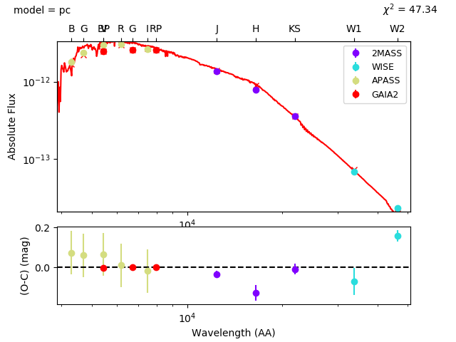
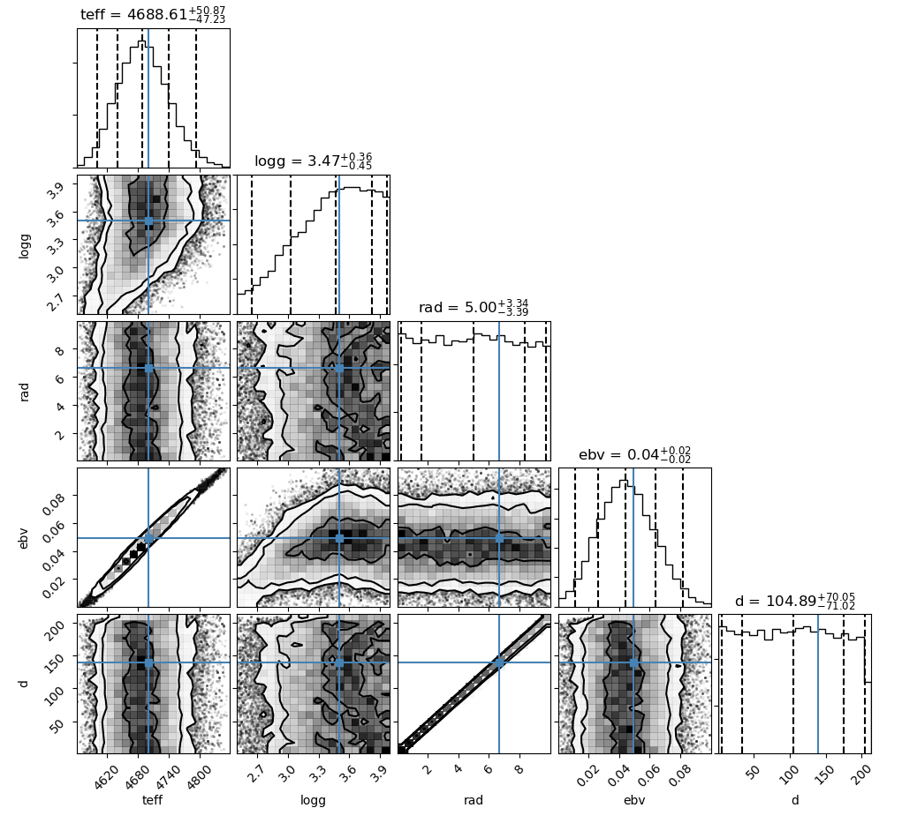
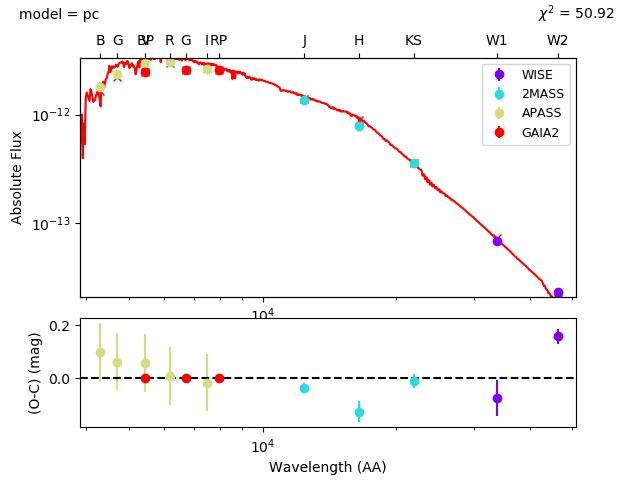
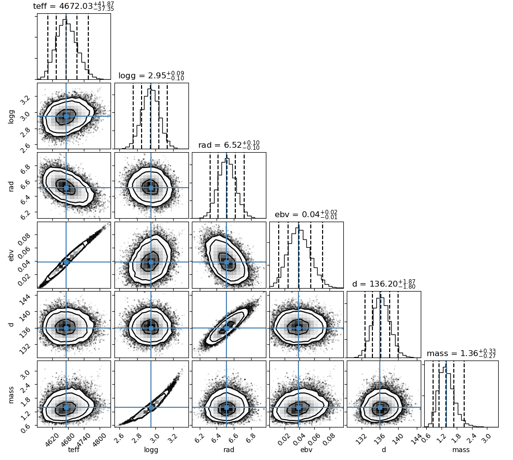

Quickstart
==========

To get you started immediatly, here is a description of how to fit the SED of the red giant
`HIP 4618 <http://simbad.u-strasbg.fr/simbad/sim-id?Ident=HIP+4618>`_. This  system is in fact a red giant binary, but
the companion is a brown dwarf and the SED is completely dominated by the primary.

Setup and searching for photometry
----------------------------------

First we need to create a setup file containing all settings necessary for the fitting process, and we need to obtain
photometry from the literature.

Speedyfit can automatically download photometry from several of the large surveys, and some smaller studies available
on Vizier. By default only photometry from the following large and well calibrated surveys is obtained:

- Gaia DR2
- Sky Mapper DR1
- APASS DR9
- SDSS DR9
- Stromgren compilation catalog of Paunzen
- 2MASS
- WISE

You can create a default setup file and download photometry for a given object as follows:

.. code-block:: bash

   speedyfit setup <object_name> -grid kurucz --phot

This will create a setup file called HIP_4618_setup_kurucz.yaml where you can setup the fitting parameters and a
photometry file called HIP_4618.phot with the obtained photometry. The object name should be resolvable by simbad,
or if that is not possible, a J-type coordinate. For example, to obtain photometry of the star 'HIP 4618' you could also
have provided the coordinate as: 'J005919.3-582417.5'

The '-grid' option lets you determine which atmosphere model will be used for the fit. You can also change this by hand
in the setup file later. Here we picked the 'kurucz' grid as it works well for giants.

The photometry file contains the following measurements:

.. code-block:: bash

    |     band |                   flux |                  eflux |
    |  GAIA2.G | 2.5868394603952325e-12 |  4.765134383579859e-16 |
    | GAIA2.BP |   2.46735399163153e-12 |  3.636027212972875e-15 |
    | GAIA2.RP |   2.55071491325932e-12 |  3.289013356019166e-15 |
    |  APASS.B | 1.7988585256582425e-12 | 1.7988585256582425e-13 |
    |  APASS.V |  2.942094782202632e-12 |  2.942094782202632e-13 |
    |  APASS.G |  2.336641341423516e-12 |  2.336641341423516e-13 |
    |  APASS.R | 3.0275544488430818e-12 |  3.027554448843082e-13 |
    |  APASS.I | 2.6320052051220464e-12 |  2.632005205122046e-13 |
    |  2MASS.J | 1.3478059822453636e-12 | 2.3586127760129225e-14 |
    |  2MASS.H |  7.890960003699894e-13 | 2.9071370348494806e-14 |
    | 2MASS.KS | 3.5720112040912657e-13 |  8.882848761004847e-15 |
    |  WISE.W1 |  6.922838260043923e-14 |  4.399556963130625e-15 |
    |  WISE.W2 |  2.357855173591615e-14 |  6.080661822738957e-16 |
    |  WISE.W3 |  5.545248458540115e-16 |  7.661043691311934e-18 |
    |  WISE.W4 |  4.532380303499413e-17 | 1.3358325527436886e-18 |

Appart from the columns given above, which are used by speedyfit, also the catalog measurment and error, unit, distance
to the target coordinates and the bibcode of the source are given.

Fitting the SED
---------------

The setup command created a default setup file where you can define the parameters of your fit. The default setup file
for a single star fit with the kurucz grid looks as follows:

.. code-block:: yaml

   # photometry file with index to the columns containing the photbands, observations and errors
    objectname: HIP_4618
    photometryfile: HIP_4618.phot
    photband_index: band
    obs_index: flux
    err_index: eflux
    photband_exclude: ['GALEX', 'SDSS', 'WISE.W3', 'WISE.W4']
    # parameters to fit and the limits on them in same order as parameters
    pnames: [teff, logg, rad, ebv]
    limits:
    - [3500, 10000]
    - [4.32, 4.32]
    - [0.05, 2.5]
    - [0, 0.1]
    # constraints on distance and mass ratio is known
    constraints:
      parallax: [7.3467, 0.0996]
    # added constraints on derived properties as mass, luminosity, luminosity ratio
    derived_limits: {}
    # path to the model grids with integrated photometry
    grids:
    - kurucz
    # setup for the MCMC algorithm
    nwalkers: 100    # total number of walkers
    nsteps: 1000     # steps taken by each walker (not including burn-in)
    nrelax: 250      # burn-in steps taken by each walker
    a: 10            # relative size of the steps taken
    # set the percentiles for the error determination
    percentiles: [0.2, 50, 99.8] # 16 - 84 corresponds to 1 sigma
    # output options
    resultfile: HIP_4618_results_kurucz.csv   # filepath to write results
    plot1:
     type: sed_fit
     result: pc
     path: HIP_4618_sed_kurucz.png
    plot2:
     type: distribution
     show_best: true
     path: HIP_4618_distribution_kurucz.png
     parameters: ['teff', 'rad', 'L', 'ebv', 'd', 'mass']

There are a few things we would like to change here. By default the logg is fixed, because fitting the surface gravity
from an SED is rather difficult, and usually won't result in useful results. Lets try to vary it between logg = 2.5 -
4.0 anyway. For this we set the 2nd line of the limits parameters to [2.5, 4.0].

Since we know that we are dealing with a giant star on the lower part of the RGB, we have to change the range of the
radius to R = 1 - 10 Rsol. So set the 3rd line of the limits parameters to [1.0, 10.0]

Lets also remove all constraints for now by setting constraints to an empty dictionary.

We are not interested in a csv output file, so remove the 'resultfile' parameter.

Finaly in the figure part, change the parameters of the distribution plot to:
'parameters : ['teff', 'logg', 'rad', 'ebv', 'd']' so that we also get the logg output.

The final file then looks like:

.. code-block:: yaml

    # photometry file with index to the columns containing the photbands, observations and errors
    objectname: HIP_4618
    photometryfile: HIP_4618.phot
    photband_index: band
    obs_index: flux
    err_index: eflux
    photband_exclude: ['GALEX', 'SDSS', 'WISE.W3', 'WISE.W4']
    # parameters to fit and the limits on them in same order as parameters
    pnames: [teff, logg, rad, ebv]
    limits:
    - [3500, 10000]
    - [2.50, 4.00]
    - [1.0, 10]
    - [0, 0.1]
    # constraints on distance and mass ratio is known
    constraints: {}
    # added constraints on derived properties as mass, luminosity, luminosity ratio
    derived_limits: {}
    # path to the model grids with integrated photometry
    grids:
    - kurucz
    # setup for the MCMC algorithm
    nwalkers: 100    # total number of walkers
    nsteps: 1000     # steps taken by each walker (not including burn-in)
    nrelax: 250      # burn-in steps taken by each walker
    a: 10            # relative size of the steps taken
    # set the percentiles for the error determination
    percentiles: [0.2, 50, 99.8] # 16 - 84 corresponds to 1 sigma
    plot1:
     type: sed_fit
     result: pc
     path: HIP_4618_sed_kurucz.png
    plot2:
     type: distribution
     show_best: true
     path: HIP_4618_distribution_kurucz.png
     parameters: ['teff', 'logg', 'rad', 'ebv', 'd']

Now lets run the fit:

.. code-block:: bash

   speedyfit fit HIP_4618_setup_kurucz.yaml

You will get the following output:

.. code-block:: bash

    Applied constraints:
         distance = 136.11553486599425 - 1.845332907652827 + 1.845332907652827
    100%|███████████████████████████████████████████████████████████████████████████| 1250/1250 [00:51<00:00, 24.36it/s]
    ================================================================================

    Resulting parameter values and errors:
       Par             Best        Pc       emin       emax
       teff       =    4699      4689   -    112   +    145
       logg       =    3.49      3.48   -   0.97   +   0.51
       rad        =    6.49      6.49   -   0.29   +   0.32
       ebv        =   0.049     0.044   -  0.043   +  0.051
       mass       =    4.72      4.67   -   4.15   +  10.81
       d          =     136       136   -      5   +      6
       L          =   18.38     18.26   -   1.72   +   2.19
       scale      =   0.000     0.000   -  0.000   +  0.000
       chi2       =  45.404    48.315   -  2.789   + 12.119

And the following two figures get created:

As you can see, only the effective temperature and reddening are determined with any precision. The other parameters,
logg, radius and distance, are not constrained at all. The derived temperature is also well in line with that determined
from spectroscopic observations: Teff = 4750 +- 100 K
`Jones et al. 2011 A&A, 536, A71 <https://ui.adsabs.harvard.edu/abs/2011A%26A...536A..71J/abstract>`_.

Constraints
-----------

There is a spectroscopic solution of this system available, so we can use that to constrain the effective temperature
and surface gravity. And there is a parallax measurement available from Gaia DR2 which was automatically added to the
setup file, but we removed it before. Let's include it now. This is a good approach if you want to determine the radius
and luminosity of the systems while also taking the errors on the spectroscopic parameters into account.

To do this we add the following lines to the constrained parameters in the setup file:

.. code-block:: yaml

    constraints:
      parallax: [7.3467, 0.0996]
      teff: [4750, 100]
      logg: [2.91, 0.10]

We can also add the mass property to the output. Since we can derive the radius from the parallax and SED, and the
surface gravity is included we can also determine the mass of the system.

We can now run the fit again:

.. code-block:: bash

   speedyfit fit HIP_4618_setup_kurucz.yaml

.. code-block:: bash

    Applied constraints:
         teff = 4750 - 100 + 100
         logg = 2.91 - 0.1 + 0.1
         distance = 136.11553486599425 - 1.845332907652827 + 1.845332907652827
    100%|███████████████████████████████████████████████████████████████████████████| 1250/1250 [00:57<00:00, 21.66it/s]
    ================================================================================

    Resulting parameter values and errors:

       Par             Best        Pc       emin       emax
       teff       =    4671      4674   -     96   +    129
       logg       =    2.94      2.95   -   0.28   +   0.27
       rad        =    6.52      6.51   -   0.28   +   0.30
       ebv        =   0.039     0.040   -  0.037   +  0.045
       mass       =    1.36      1.36   -   0.65   +   1.19
       d          =     136       136   -      5   +      6
       L          =   18.12     18.13   -   1.55   +   1.93
       scale      =   0.000     0.000   -  0.000   +  0.000
       chi2       =  47.569    50.891   -  3.202   + 13.056

As you can see, the surface gravity is now constrained to more or less the same value as we provided for the prior. The
same goes for the distance, as both these parameters can't really be constrained from an SED fit alone. The
effective temperature however is more of less the same as in the unconstrained fit. This is because the SED required a
much smaller distribution than we gave in the prior. If you look at the SED, you can see this is most likely caused by
the Gaia photometry which has very small errors. The radius has very small errors now, as the Gaia parallax is very
precise. The mass parameters (which is not fitted, but included as a derived parameter similar to luminosity) is now
also quite well constrained.

If you noticed the difference in errors between the terminal output, and the distribution figure. This is caused because
both use different parameters to set those. The terminal output (and is requested also the results file) use the
percentiles parameter, while the distribution figure has different parameters to set the percentiles. Have a look at the
:doc:`setup_file` and :doc:`making_figures` documentation for more info.